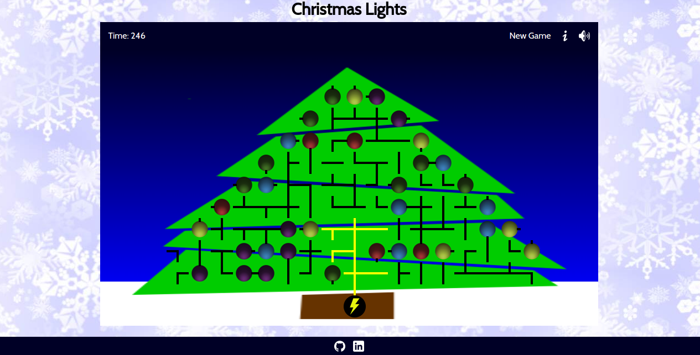

# Christmas Lights Game

[Live Game][live]
[live]: https://lewhitley.github.io/ChristmasLights/

## Background

The Christmas Lights Game is a logic game where the player has to connect all of the bulbs to the electricity connecting the wires properly. Each square of the triangular grid has either a bulb or a piece of wire that can be rotated to connect it to different pieces. Once a bulb is connected to the electricity it is lit up, and once all of the bulbs are lit, the game is won.

The basic features of this game are outlined in the **Functionality & MVP** and **Bonus Features** sections.  


## Features & Implementation

### Board

Wires, bulbs, and the Christmas tree are rendered to the user with three layered HTML Canvases. The background, tree, and electrical base are drawn on the bottom canvas layer upon loading the page, allowing individual sections of the other canvases to be cleared and redrawn without changing the setting. A second canvas is used to draw the lit wires and bulbs, while the top layer shows the user the unlit wires and bulbs.



### Game

The user clicks on the top canvas, on which there is a click listener. From the click event, the coordinates are adjusted to match the grid of bulbs and wires and the selected wire/bulb is rotated. On each click, a Depth-First Traversal is run to find all of the lit paths on the tree before redrawing the tree again. Starting from the root, all of the children of each connected node are found with logic that checks the orientation of each of the surrounding pieces. setChildren is recursively called on all of the child wires until the leaves are reached.

```js
updateLit(elec){
  if (!elec) {
    let base = this.grid[8][8];
    base.lit = true;
    this.setChildren(this.grid[8][8]);
  }
  this.draw();
}
```

At the start of the game, pieces are turned in random directions which are updated as the user clicks on different pieces. After each click, the Game checks whether all of the bulbs are lit and activates a modal when they are.

### Wires and Bulbs

Both of these classes inherit from the Elec class to DRY up the code. Since both of these classes have lit, position, and orientation properties, the Elec constructor handles those. Elec also takes care of rotating and reseting parent nodes for these pieces.

Wire also has a shape property and a function to add and empty child nodes used by the Game class. Bulbs have a color property and draw function specific to the bulb.

### About and Timer

The Board class handles the game timer, which starts when the page is loaded. The About modal is built in index.html and an event listener to show the modal is added in the Board constructor function. The Board constructor also sets up the music play/pause logic.

## Architecture and Technologies

This project was implemented with the following technologies:

- Vanilla JavaScript for overall structure and game logic,
- `HTML5 Canvas` for DOM manipulation and rendering,
- Webpack to bundle and serve up the various scripts.


## Future Features

### Add multiple choices for solved puzzles

I will need to find other puzzles to implement and possibly create other files to hold the game setups. The Game class will then randomly select from the built games when reloading a new page for the user to play.

### Add the ability for the window to record scores

This will allow a user to compare their scores and see whether they are getting faster. I would need to store time data for each game in the session to render to the user.
